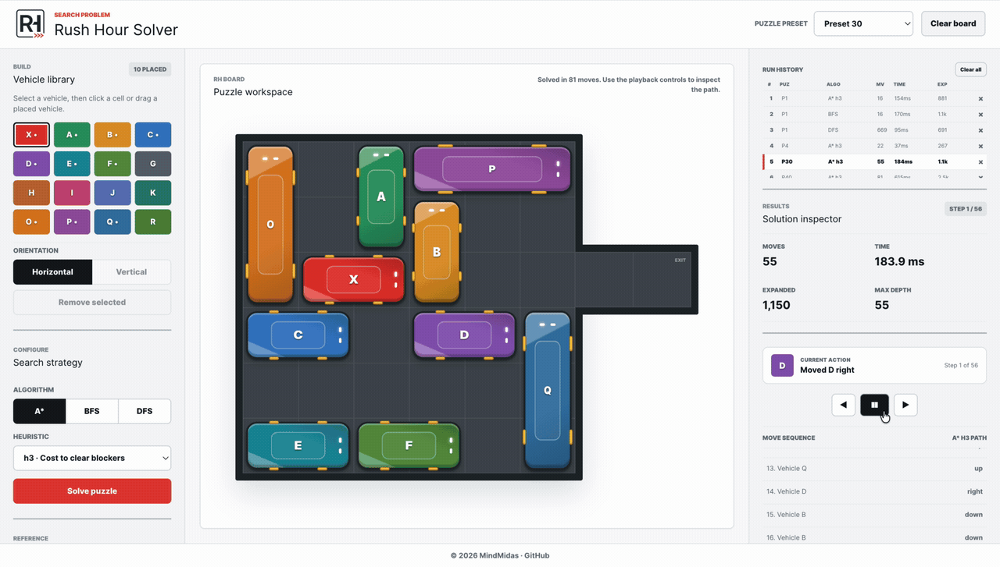

<p align="center">
  <picture>
    <source media="(prefers-color-scheme: dark)" srcset="src/frontend/assets/rushhour_white.png">
    
  </picture>
</p>

<p align="center">
  <strong>Puzzle editor and solver</strong><br>
  A*, BFS, and DFS on Rush Hour boards
</p>

<p align="center">
  
  
  
</p>

<p align="center">
  Place vehicles, load preset boards, compare search algorithms, and play back solutions step by step.
</p>

<p align="center">
  
  
  
  
  
  
  
</p>

<p align="center">
  
</p>

## Overview

- Interactive 6×6 board editor with 40 bundled presets.
- BFS, DFS, and Best-First / A* search from the browser UI.
- Three heuristics for Best-First / A*: `h1`, `h2`, and `h3`.
- View solutions move by move, past runs, and compare algorithms on runtime and search cost.
- CLI support for running searches from terminal.

**Best-First Search and A\* are used interchangeably in this project.** They refer to the same heuristic search implementation. The browser button says **A\***, while the API, solver, and CLI use the identifier `bestFS`.

| Name | Where it appears |
|---|---|
| BFS | UI, API (`bfs`), CLI |
| DFS | UI, API (`dfs`) |
| Best-First / A* | UI label **A\***; API and CLI use `bestFS` |

Heuristics for `bestFS`:

- `h1`: distance of the red car `X` to the exit (Manhattan distance).
- `h2`: `h1` plus number of blocking cars in the way.
- `h3`: `h1` plus cost to move blocking cars.

## Commands

Web app:

```bash
python3 -m src.server.app
```

Then open `http://127.0.0.1:8000`.

CLI (run from the project root; requires Python 3.10+):

```bash
python3 -m src.solver.runner [algorithm] [options]
```

Examples:

```bash
python3 -m src.solver.runner bfs --file src/data/boards/1
python3 -m src.solver.runner bestFS --h h1 --file src/data/boards/1
python3 -m src.solver.runner bfs bestFS --h h1 h2 h3 -loop   # all 40 puzzles; reads boards/1..40
```

For `-loop`, create a `boards` link first: `ln -sf src/data/boards boards`.

Use one algorithm to print the solution in the terminal. Use `bfs` and `bestFS` together to write comparison JSON (`bfs_results.json`, `h1_results.json`, etc., plus `results.json` when both are run).

## Project Map

| Path | Purpose |
|---|---|
| `src/data/boards/` | 40 preset puzzle files. |
| `src/frontend/` | Browser UI, built CSS/JS, logos, demo GIF, write-up PDF, and social preview source. |
| `src/frontend/assets/` | Logos, demo GIF, source recording, write-up PDF, and social preview image. |
| `src/server/app.py` | Local HTTP server and JSON API. |
| `src/solver/` | Rush Hour search problem, solver, and CLI runner. |
